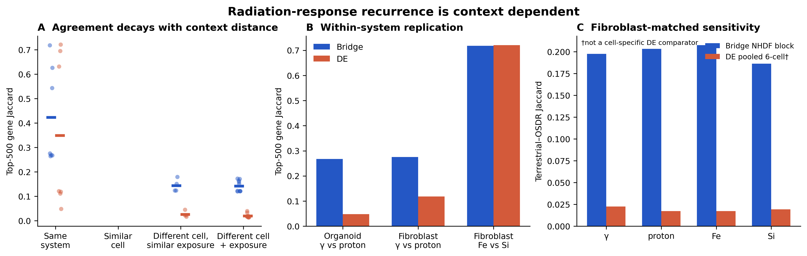

# Radiation-context sensitivity analysis

## Bottom line

The weak expanded-ChEMBL radiation drug convergence (Bridge 0.064; DE 0.074) does **not** reflect an absence of recurrent Bridge radiation biology. Gene-level agreement is strong within matched experimental systems and decreases as tissue/exposure context diverges. Bridge retains substantially more agreement than DE across studies, although neither method produces a context-invariant directional response.

The appropriate benchmark structure is therefore hierarchical: (i) within-system modality replication, (ii) matched-cell cross-study replication, and (iii) deliberately difficult cross-tissue generalization. The present datasets should be retained, but their pooled drug Jaccard should not be treated as the primary radiation endpoint.

## Frozen inputs and scope

This is a new sensitivity layer over the completed benchmark. It reused the frozen Bridge and DE rankings and top-500 modules. It did not rerun expression preprocessing, embeddings, condition vectors, attribution, DE, module construction, or either ChEMBL benchmark.

Seven frozen contrasts were examined: GSE297090 gamma and proton; the pooled GSE184119 10-Gy common effect; and GSE297560/OSD-993 gamma, proton, iron, and silicon. Similarity was evaluated for Bridge top-500, DE top-500, Bridge-only, and DE-only sets. Overlap significance used 2,000 independently drawn expression-decile-matched random gene sets per pair and BH correction within each analysis family. Full rankings supplied overlap-restricted Spearman correlations and score-sign concordance.

The context classes were fixed before interpretation:

1. same experimental system, different exposure;
2. similar cell type, different study/exposure;
3. different cell type, similar exposure;
4. different cell type and different exposure.

No full contrast-level category-2 pair exists because the frozen GSE184119 DE contrast is a pooled six-cell coefficient. A supplementary frozen NHDF attribution block permits a Bridge fibroblast-to-fibroblast sensitivity analysis, but not a cell-specific DE comparison.

## 1. Context hierarchy

| Context distance | Pairs | Bridge mean Jaccard | DE mean Jaccard | Bridge − DE | Interpretation |
|---|---:|---:|---:|---:|---|
| 1: same system | 7 | 0.423 | 0.349 | +0.074 | High but heterogeneous within-system agreement |
| 2: similar cell, cross-study | — | — | — | — | No fair frozen full-contrast pair |
| 3: different cell, similar exposure | 4 | 0.144 | 0.027 | +0.118 | Bridge retains a cross-context core; DE nearly collapses |
| 4: different cell and exposure | 10 | 0.142 | 0.020 | +0.122 | Similar result under maximal mismatch |

Bridge agreement decreased with distance (Spearman rho = -0.780, permutation p = 0.0002); DE decreased slightly more steeply (rho = -0.820, p = 0.0001). Relative to distance 1, mean Bridge Jaccard fell about 66% in cross-study classes 3–4, while DE fell about 94%. Across all 21 matched pairs, Bridge exceeded DE in 18 (mean paired difference +0.105; Wilcoxon p = 1.8e-5). The distance-4 difference was also supported on its own (+0.122; 10/10 pairs; p = 0.00195). These tests are exploratory because pairs sharing a study or control arm are not independent biological replications.

Bridge-only genes followed essentially the same decay (rho = -0.774, p = 0.0002), with mean Jaccards 0.349, 0.133, and 0.130 at distances 1, 3, and 4. Every Bridge and Bridge-only pair exceeded its expression-matched random null after BH correction (minimum attainable raw p = 1/2001). In contrast, only 1/4 distance-3 and 2/10 distance-4 DE pairs passed raw p < 0.05.

Rank agreement was more modest than set overlap across divergent contexts, and sign concordance was frequently only 0.5–0.7. Thus Bridge reproducibly **prioritizes** a shared program, but its signed response is context dependent.

## 2. Within-system contrasts

| Comparison | Bridge overlap / Jaccard | DE overlap / Jaccard | Bridge overlap-rank rho | DE overlap-rank rho |
|---|---:|---:|---:|---:|
| GSE297090 organoid gamma vs proton | 211 / 0.267 | 46 / 0.048 | 0.356 | 0.286 |
| OSD-993 fibroblast gamma vs proton | 216 / 0.276 | 106 / 0.119 | 0.376 | 0.091 |
| OSD-993 fibroblast proton vs iron | 352 / 0.543 | 387 / 0.631 | 0.745 | 0.794 |
| OSD-993 fibroblast proton vs silicon | 385 / 0.626 | 410 / 0.695 | 0.808 | 0.802 |
| OSD-993 fibroblast iron vs silicon | 418 / 0.718 | 419 / 0.721 | 0.876 | 0.869 |

The organoid result is the cleanest evidence of a Bridge advantage within one biological system: Bridge recovers 211 common genes versus 46 for DE. Both methods are highly stable among the three OSD-993 charged-particle contrasts. That near-identity must not be counted as three independent replications: the contrasts use the same fibroblast system and shared controls, and similar profiles may partly reflect shared design and sampling.

The frozen GSE184119 analysis cannot test single-dose versus fractionated exposure. Although 2 Gy × 5 samples exist in its manifest for ADSC and LEC, the only frozen ranking is 10 Gy versus 0 Gy; constructing a new ranking would violate this analysis's no-rerun constraint.

## 3. Fibroblast-to-fibroblast sensitivity

| OSD-993 modality | Bridge NHDF overlap / Jaccard | Matched-random p | Frozen pooled-DE overlap / Jaccard | Matched-random p |
|---|---:|---:|---:|---:|
| Gamma | 165 / 0.198 | 0.0005 | 22 / 0.022 | 0.406 |
| Proton | 169 / 0.203 | 0.0005 | 17 / 0.017 | 0.784 |
| Iron | 172 / 0.208 | 0.0005 | 17 / 0.017 | 0.773 |
| Silicon | 157 / 0.186 | 0.0005 | 19 / 0.019 | 0.596 |

The frozen GSE184119 NHDF Bridge attribution block gives consistent fibroblast-to-fibroblast agreement with every OSD-993 modality (mean Jaccard 0.200). This is higher than the general cross-study Bridge mean (~0.143), supporting the context-distance hypothesis. However, the DE values above use the frozen pooled six-cell common-effect coefficient. They demonstrate that pooling obscures fibroblast agreement, but they are **not** a fair cell-specific Bridge-versus-DE comparison. A definitive method comparison would require a predeclared NHDF-specific DE and Bridge contrast in a future analysis.

## 4. Reproducible core and context-specific programs

Definitions were mechanical: strict universal = top-500 in all seven contrasts; majority cross-study core = at least four contrasts spanning at least two studies; context-specific = one contrast only.

| Set | Strict universal | Majority cross-study core | Context-specific |
|---|---:|---:|---:|
| Bridge | 15 | 237 (15 strict + 222 additional) | 730 |
| DE | 0 | 35 | 1,630 |

The 15 strict Bridge genes are **ADIPOR1, ALDH3B1, CDKN2C, CENPF, CPT1A, CYB561D2, GAL3ST4, ITGA3, KCTD3, LAMB2, POGLUT2, PXDC1, SLC17A9, TIMP1,** and **UBE2A**. Only five have the same attribution sign in all seven contrasts; the median majority-sign fraction is 0.714. This is therefore a universal prioritization core, not a universal signed-response vector.

The strict core is enriched after FDR correction for laminin/MET–PTK2 motility and extracellular-matrix terms (top Reactome q = 0.0148). The inclusive 237-gene majority core is enriched for extracellular-matrix organization (top Reactome q = 3.46e-8), apoptosis/programmed cell death, proliferation, and tissue development. These are coherent radiation/stress/remodeling programs, but broad developmental and cell-death ontologies are not radiation-specific evidence. The machine-readable `classification` column is exclusive: its 222 majority rows omit the 15 genes separately labeled strict universal.

Context-restricted recurrence is biologically interpretable:

- the organoid-specific recurrent Bridge set (92 genes) is enriched for digestion, intestinal absorption, tight junctions, and epithelial junction organization (top q = 6.24e-5);
- the OSD-993 fibroblast-specific recurrent Bridge set (293 genes) is enriched for extracellular-matrix organization, morphogenesis, and cytoskeleton in muscle cells (top q = 5.83e-11).

This pattern is consistent with a shared stress/remodeling core plus tissue-specific response, rather than one invariant radiation signature.

## 5. Recurrent Bridge-only genes

There are 677 Bridge-only genes recurring in at least two contrasts, 414 spanning at least two studies, and 84 spanning all three studies. Eight are Bridge-only in all seven contrasts: **ADIPOR1, ALDH3B1, CYB561D2, KCTD3, POGLUT2, PXDC1, SLC17A9,** and **UBE2A**. All 414 cross-study genes occur in OSD-993 by construction of the three-study recurrence; their exact contrasts, ranks, signs, OSD-993 flag, pathway memberships, and targetability are in the annotated table.

The 414-gene recurrent Bridge-only set is strongly enriched for extracellular-matrix organization (Reactome q = 8.35e-8; 30 genes), hemostasis (q = 8.33e-6), collagen formation, cell-surface/vascular-wall interactions, proliferation, and tissue development. This shows that the Bridge-only recurrence is not merely a list of disconnected genes. It remains possible that part of the signal represents generic injury/remodeling rather than radiation specificity.

## 6. Secondary target/drug mapping

Of the 414 cross-study recurrent Bridge-only genes, 76 occur anywhere in expanded ChEMBL and 40 connect to at least one drug passing the frozen >10-target eligibility rule. Highly connected examples include TUBB6 (68 eligible drugs), ERBB2 (19), CA2 (17), CDK7 (12), SIGMAR1 (12), CACNB3 (9), LIMK1 (8), and RPS6KA2 (7). These are target-resource hubs and must not be interpreted as equivalent biological support.

No core-drug enrichment passes BH FDR:

- Bridge majority core: ocriplasmin is nominally top-ranked through COL1A2/COL4A2/LAMB1/LAMB2/LAMC2 (p = 2.27e-4, q = 0.0830);
- recurrent cross-study Bridge-only set: ocriplasmin is again top-ranked through extracellular-matrix targets (p = 3.88e-4, q = 0.142);
- DE majority core: no corrected enrichment (minimum q = 1.0).

This secondary mapping identifies targetable nodes in a recurrent program. It is not evidence of therapeutic efficacy, benefit, or transcriptional reversal. It also explains why biological recurrence need not yield stable drug-set Jaccard: many recurrent genes are untargeted, a few hubs map to many drugs, and tissue-specific modules change which multi-target drugs cross an enrichment threshold.

## 7. Interpretation of the weak radiation drug result

The evidence favors **biological/experimental heterogeneity plus target-map compression** as major explanations for weak drug convergence:

- tissue matching improves Bridge gene agreement (NHDF-to-OSD fibroblast mean Jaccard 0.200 versus ~0.143 across mismatched studies);
- Bridge gene recurrence remains significant across all contexts even where DE recurrence is near random;
- recurrent Bridge biology is distributed across shared injury/remodeling and tissue-specific epithelial or fibroblast programs;
- no drug enrichment survives FDR, so thresholded drug lists are intrinsically unstable;
- expanded ChEMBL maps the recurrent program unevenly, with prominent promiscuous hubs.

Other explanations remain active. GSE184119 has only two samples per cell type/condition and OSD-993 has small arms, so power is limited. Dose, fractionation, modality, time, culture model, and cell composition differ materially. The data do not establish one stable signed radiation program, and they do not show a universal Bridge advantage within every matched system: DE equals or exceeds Bridge among closely related OSD-993 charged-particle contrasts.

## 8. Recommendation

Retain all three radiation datasets, but restructure the benchmark:

1. **Tier 1 — within-system modality stability:** GSE297090 gamma/proton and OSD-993 modalities;
2. **Tier 2 — matched-cell cross-study sensitivity:** GSE184119 NHDF block versus OSD-993 fibroblasts, explicitly labeled Bridge-only until a cell-specific DE contrast is prospectively defined;
3. **Tier 3 — cross-tissue generalization:** organoid, pooled multi-cell, and fibroblast contrasts, where context-specificity is an expected outcome rather than a failure;
4. **Secondary endpoint:** expanded-ChEMBL target/drug mapping of a reproducible gene core, never the primary radiation endpoint.

Better-matched radiation datasets are warranted for a definitive replication, but should be acquired in a separate planned phase. The most valuable addition would be human dermal fibroblast bulk RNA-seq with sham controls, matched gamma/proton/iron/silicon dose and post-exposure time, at least 5–6 biologically independent donors or replicates per arm, donor-aware metadata, accessible counts/TPM, and preferably no ARCHS4 exposure. A matched intestinal-organoid replication would provide an orthogonal second context. No new data were downloaded here.

## Reproducibility and limitations

- Pairwise statistics: [contrast_pair_similarity.csv](contrast_pair_similarity.csv)
- Context summaries and trends: [context_distance_summary.csv](context_distance_summary.csv), [context_distance_trends.csv](context_distance_trends.csv)
- Direct method comparison: [bridge_vs_de_stability.csv](bridge_vs_de_stability.csv)
- Fibroblast analysis: [fibroblast_comparison.csv](fibroblast_comparison.csv)
- Core definitions and full details: [radiation_core_genes.csv](radiation_core_genes.csv), [radiation_core_gene_details.csv.gz](radiation_core_gene_details.csv.gz)
- Recurrent Bridge-only annotations: [recurrent_bridge_only_genes_annotated.csv.gz](recurrent_bridge_only_genes_annotated.csv.gz)
- Pathways and provenance: [core_pathway_enrichment.csv.gz](core_pathway_enrichment.csv.gz), [core_pathway_summary.csv](core_pathway_summary.csv), [core_pathway_provenance.json](core_pathway_provenance.json)
- ChEMBL mapping and enrichment: [core_expanded_chembl_target_mapping.csv](core_expanded_chembl_target_mapping.csv), [core_expanded_chembl_enrichment.csv](core_expanded_chembl_enrichment.csv)
- Full computational provenance: [provenance.json](provenance.json)

The context-distance trend has only three studies, no full category-2 method-comparable pair, and non-independent contrast pairs. It should be treated as structured sensitivity evidence, not a population-level estimate of how similarity decays with biological distance.
